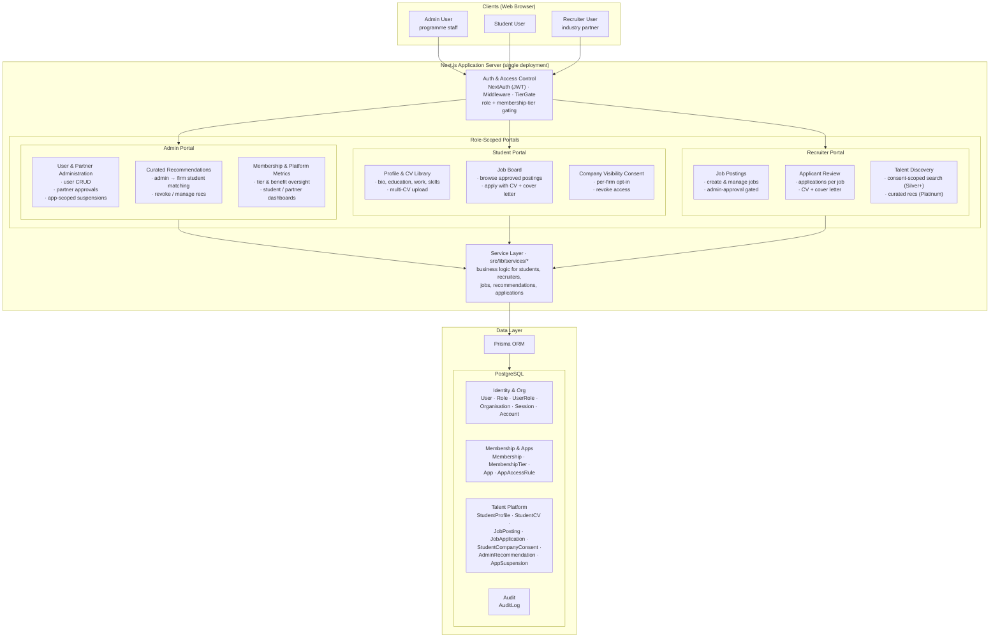

# Systems Architecture

High-level view of how the UCL CS Alliances platform is structured: three user audiences (clients), a single Next.js application that serves all three role-scoped portals, and the shared data layer underneath.

All portals are served from **one Next.js 16 deployment** (App Router). Role and membership-tier access is enforced uniformly at the edge (middleware + NextAuth JWT) and at the feature boundary (`userCanAccessApp`, `userCanAccessFeature`, `TierGate`). Portal code reads and writes through a shared service layer (`src/lib/services/*`) which is the only caller of Prisma.

## Diagram

## How to read

- **Clients** — three human audiences hitting the same origin from a browser.
- **Auth &amp; Access Control** — every request passes through middleware-enforced auth and tier gating before reaching a portal. ADMIN bypasses tier rules; STUDENT / RECRUITER are evaluated against role + active membership tier.
- **Role-scoped portals** — UI surfaces grouped by audience. Each node lists the ~3 headline capabilities. Admins can reach every portal; recruiters and students are scoped to their own.
- **Service layer** — portals and API routes call into `src/lib/services/*` (e.g. `student-services.ts`, `recruiter-search.ts`, `job-board.ts`, `recommendations.ts`, `applications.ts`). Portals never call Prisma directly.
- **Data layer** — a single PostgreSQL database accessed through Prisma, grouped into four logical domains that match the `prisma/schema.prisma` sections.
