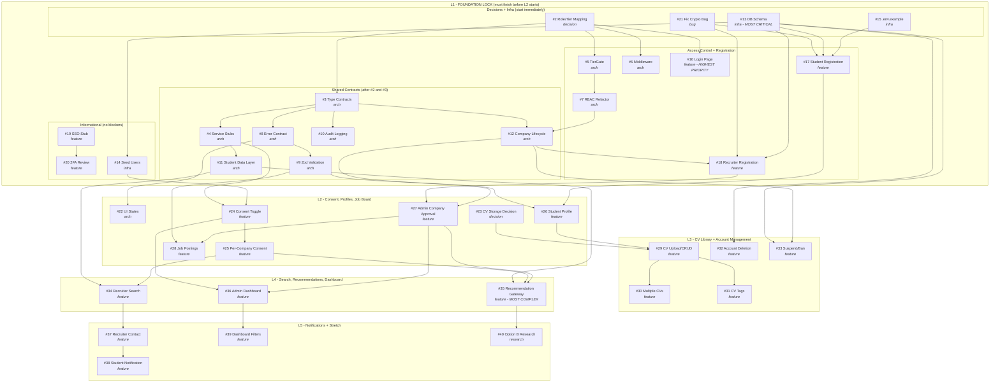

# Talent Platform V1 - Dependency Map

> **Who this is for:** Every team member, including those newer to development or working in a second language. Every technical term is explained when it first appears.
>
> **What this document does:** Shows how every GitHub issue connects to other issues, what order things must be built, and why. Use it alongside the GitHub project board to understand what you can work on and what you're waiting for.
>
> **Note on issue numbers:** All `#N` references in this document match the actual GitHub issue numbers at github.com/gianpremrajaram/talent_platform_v1/issues. Issues run from #2 to #40.
>
> **For more detail on any topic, see:**
> - `Docs/scaffold_architecture_eval.md` - walkthrough of the existing codebase
> - `Docs/implementation_playbook.md` - coordination plan and architectural decisions
> - `Docs/coding_start_planning.pdf` - original planning doc and requirement IDs
> - `Docs/Architecture-gaps-vs-planning-doc.txt` - cross-cutting architecture review

---

## How to Read This Document

**Read this section first.** It explains four concepts you need to understand everything else.

### What is a "dependency"?

A dependency means: *"This ticket cannot be started until another ticket is finished."*

When a ticket says **"Depends on #13"**, it means: finish ticket #13 first, then start this one.

When a ticket says **"Blocks #24, #26"**, it means: tickets #24 and #26 are waiting for this one to finish.

### What are "layers" (L1 through L5)?

Layers are groups of tickets that must be completed roughly in order. Think of them as floors of a building:

- **L1 (Foundation)** -  Everything sits on top of this. L2 cannot start until L1 is complete.
- **L2 (Core features)** - consent controls, student profiles, job board. Can only start once L1 is done.
- **L3 (CV library)** - CV upload, multiple CVs, account deletion. Built on top of L2.
- **L4 (Search and recommendations)** - the most complex features. Built on top of L2 and L3.
- **L5 (Stretch)** - notifications and optional extras. Only if time allows.

Within each layer, some tickets can be worked on **at the same time** by different people = parallelised. Even within a layer, some tickets depend on others - always check the dependency list before starting.

### What is a "service stub"?

A stub is a placeholder function that returns fake data. We create stubs early so that anyone building a page can call a real function name (like `getStudentProfile(userId)`) and get back a fake result that has the correct shape. Later, someone replaces the fake data with real database queries. The page code never needs to change - only the service file underneath changes.

**Example:** You build a student profile page that calls `getStudentProfile("123")`. Today it returns fake data. Next week, someone wires it to the real database. Your page still works without any changes.

### What is "schema drift"?

Schema drift happens when two developers have different database structures on their machines. Developer A adds a new column but hasn't pushed it yet. Developer B writes code that needs that column but doesn't have it. Both break silently. This is the single biggest risk in the project, which is why the database schema (#13) must be done once, in one go, before anyone starts building features.

---

## What We Are Building - Plain English Summary

The **Talent Platform** connects UCL students with companies. Three user types:

(1) **Students** create profiles, upload CVs, and choose which companies can see them. This choice is called "consent" - it's the core privacy feature. (2) **Recruiters** work for companies and want to find students. Not all recruiters see the same things - their company's membership tier (Silver, Gold, Platinum) determines what features they can access. Higher tiers see more. (3) **Admins** approve new companies, manage users, and can recommend specific students to specific companies.

We build on top of an existing codebase ("the scaffold") that already handles login and membership. We are adding the talent features on top.

---

## The Build Order - How Everything Connects

**Phase 1 - Decisions and database (Issues #2, #13, #15).** Before any code, we need three things: (a) a written decision mapping the scaffold's existing user roles to our user types (#2), (b) the database tables created for all V1 features in one migration (#13), and (c) an environment variable template so every developer's setup is identical (#15). 

**Phase 2 - Shared code contracts (Issues #3, #4, #8, #9, #10, #11, #12).** Once the role mapping is decided (#2), we define every data shape in one file (#3 type contracts). Then we create placeholder service functions (#4) that return fake data matching those shapes. We also set up shared patterns for error handling (#8), input validation (#9), audit logging (#10), student data access (#11), and company status tracking (#12). These are "invisible" pieces - users never see them directly - but every visible feature depends on them.

**Phase 3 - Access control and login (Issues #5, #6, #7, #16, #17, #18).** The TierGate component (#5) and middleware (#6) control who can see what. The RBAC refactor (#7) cleans up existing access control code. The login page (#16) gets reviewed and fixed. Student (#17) and recruiter (#18) self-registration are built. After this phase, all three user types can log in and land on their correct dashboard.

**Phase 4 - Consent and profiles (Issues #22-#28, L2).** Students can toggle their visibility (#24), control which specific companies see them (#25), and fill in their profile (#26). Admins can approve pending company registrations (#27). Recruiters can post jobs (#28). A storage decision for CVs is made (#23).

**Phase 5 - CV library (Issues #29-#33, L3).** Students upload and manage CVs (#29, #30), tag them with keywords (#31). Account deletion is fixed for GDPR (#32). Admin suspend/ban is built (#33).

**Phase 6 - Search and recommendations (Issues #34-#36, L4).** This is where all prior work comes together. Recruiters search for consented students (#34). Admins recommend students to companies (#35) - this is the most complex single feature. The admin dashboard shows platform metrics (#36).

**Phase 7 - Notifications and stretch (Issues #37-#40, L5).** Recruiter contact via email (#37), student notifications (#38), dashboard filters (#39), and a deferred research item (#40). All optional for V1.

---

## The Most Important Rule

> **L1 must be 100% complete before anyone starts L2.**

This is not flexible. Without L1, there is no shared database structure, no shared type definitions, and no agreed user model. If two developers start L2 features before L1 is done, they will invent their own data shapes and break each other's code.

**The two most critical L1 tickets:**
- **#13 (Database schema)** - should be the first thing completed. Every other ticket in the project ultimately depends on having the right tables.
- **#16 (Login page)** - the most visible L1 deliverable. Sadhana owns this. Without a working login, nobody can test anything end-to-end.

---

## Visual Dependency Diagram

This diagram shows all 39 tickets grouped by layer. Arrows mean "must be done before." Tickets with no arrows between them within the same layer can be done in parallel.

---

## Layer-by-Layer Ticket Breakdown

Each ticket described in plain language with dependencies and blockers.

---

### L1 - Foundation Lock

> **What this layer is:** L1 is the foundation. It contains all decisions, database tables, shared code, and infrastructure that every visible feature depends on. 
>
> **Who needs to finish this:** T The login page (#16) is the most visible priority. The database schema (#13) is the most critical to do first.

#### #2 - Role and Tier Mapping *(decision)* | **Depends on:** Nothing | **Blocks:** #3, #5, #6, #7, #16, #17, #18
A written decision mapping the scaffold's existing user roles and tiers to our platform's user types. Without this, every dev interprets the user model differently.

#### #3 - Type Contracts *(arch)* | **Depends on:** #2 | **Blocks:** #4, #8, #10, #12, all L2+
A single file (`src/types/index.ts`) defining the shape of every shared data entity. Prevents parallel builders from inventing conflicting data shapes.

#### #4 - Service Stubs *(arch)* | **Depends on:** #3 | **Blocks:** #11, #24, all L2+
Six placeholder service files returning fake data. Pages call real function names from day one; real DB logic replaces fakes later without page changes.

#### #5 - TierGate Component *(arch)* | **Depends on:** #2 | **Blocks:** #7, all L2+ tier-restricted UI
A React component that shows/hides page sections based on user tier. Replaces inline `if (user.tier === 'gold')` checks.

#### #6 - Middleware Route Protection *(arch)* | **Depends on:** #2 | **Blocks:** All L2+ route access
Checks auth and tier before a page loads. First layer of defence (TierGate is second layer within the page).

#### #7 - RBAC Refactor *(arch)* | **Depends on:** #2, #5 | **Blocks:** #12, all L2+ feature-level gating
Cleans up hardcoded tier numbers in page files. Adds `userCanAccessFeature()` with a central permission config.

#### #8 - Error Handling Contract *(arch)* | **Depends on:** #3 | **Blocks:** #9, #22, all L2+ API routes
Shared error format: `{ success, data, error: { code, message } }`. Plus client-side error boundary component.

#### #9 - Zod Validation *(arch)* | **Depends on:** #3, #8 | **Blocks:** #26, #28
Input validation library. Ensures form data is correct before hitting the database.

#### #10 - Audit Logging *(arch)* | **Depends on:** #3 | **Blocks:** #34, #35
Centralised `auditLog()` function for GDPR compliance. Logs every access to student data.

#### #11 - Student Data Access Layer *(arch)* | **Depends on:** #4 | **Blocks:** #34, #35, #36
Single function `getStudents()` that applies different visibility rules based on who is asking (recruiter vs admin vs dashboard).

#### #12 - Company Lifecycle State Machine *(arch)* | **Depends on:** #3, #7 | **Blocks:** #18, #27, #33
Defines company states (PENDING, APPROVED, SUSPENDED, BANNED). Wires into auth flow so suspended companies are blocked.

#### #13 - Extend Database Schema *(infra)* | **Depends on:** Nothing | **Blocks:** #14, #17, #18, #32, #33, all L2+
Adds 6 new tables in one migration. **Most critical ticket in the entire project.** All team members must run `npx prisma migrate dev` after this lands.

#### #14 - Seed Test Users *(infra)* | **Depends on:** #13 | **Blocks:** L2 testing (#24, #26)
Adds fake student/admin/recruiter accounts for local development testing.

#### #15 - Environment Variable Template *(infra)* | **Depends on:** Nothing | **Blocks:** #17, developer onboarding
`.env.example` file listing all required env vars. Updated whenever a new var is added.

#### #16 - Login Page Review and Refactor *(feature)* | **Depends on:** #2 | **Blocks:** All authenticated features
**Highest-priority L1 feature. Sadhana owns.** Fixes post-login routing for all roles and removes admin-only register gate.

#### #17 - Student Self-Registration *(feature)* | **Depends on:** #13, #15, #21 | **Blocks:** #24, #26
New `/register` page for UCL students. Domain validated against dummy list for dev.

#### #18 - Recruiter Self-Registration *(feature)* | **Depends on:** #13, #12 | **Blocks:** #27
Extends `/register` for recruiters. Account starts in pending state until admin approves.

#### #19 - SSO Placeholder *(feature)* | **Depends on:** Nothing | **Blocks:** #20
Documentation and commented-out stub for future UCL SSO integration. Not built for V1.

#### #20 - 2FA Review *(feature)* | **Depends on:** #19 | **Blocks:** Nothing
Assessment of 2FA feasibility for post-handover. Not built for V1.

#### #21 - Fix Password Generation *(bug)* | **Depends on:** Nothing | **Blocks:** #17, #18
Replaces insecure `Math.random()` with `crypto.randomBytes()` for temp passwords.

---

### L2 - Consent, Profiles, Job Board

> **Parallel work possible:** #26 (student profile), #27 (admin approval), and #28 (job postings) can be worked on simultaneously by different developers.

#### #22 - UI State Components *(arch)* | **Depends on:** #8 | **Blocks:** Nothing strictly
Shared loading spinner, empty state, and error display components. Recommended before L2 UI work.

#### #23 - CV Storage Decision *(decision)* | **Depends on:** Nothing | **Blocks:** #29
Decision on how CVs are stored (URL field vs S3 vs database). Playbook recommends URL field for V1.

#### #24 - Consent Toggle *(feature)* | **Depends on:** #4, #14 | **Blocks:** #25
Binary on/off switch for student visibility to recruiters. Default is hidden.

#### #25 - Per-Company Consent *(feature)* | **Depends on:** #24 | **Blocks:** #34, #35
Extends consent with per-company granularity. Students can whitelist/blacklist specific companies.

#### #26 - Student Profile Form *(feature)* | **Depends on:** #9, #17 | **Blocks:** #29
Fills the empty StudentView with profile editor. Fields: skills, experience, degree, location, certifications, projects, LinkedIn, GitHub.

#### #27 - Admin Company Approval *(feature)* | **Depends on:** #18, #12 | **Blocks:** #28, #35, #36
Admin reviews pending companies, selects tier (Silver/Gold/Platinum), approves or rejects.

#### #28 - Recruiter Job Postings *(feature)* | **Depends on:** #9, #27 | **Blocks:** Nothing
Job posting form. Text-only for V1. Students can browse active listings.

---

### L3 - CV Library and Account Management

#### #29 - CV Upload/CRUD *(feature)* | **Depends on:** #23, #26 | **Blocks:** #30, #31
Core CV management. Implementation depends on storage decision. Uses storage abstraction interface.

#### #30 - Multiple CVs *(feature)* | **Depends on:** #29 | **Blocks:** Nothing
Multiple CVs per student with labels (e.g. "ML-focused").

#### #31 - CV Keyword Tags *(feature)* | **Depends on:** #29 | **Blocks:** #35 (optional filter)
Tags on CVs used by admin recommendation filter. Can be pushed to stretch.

#### #32 - Account Deletion Fix *(feature)* | **Depends on:** #13 | **Blocks:** Nothing
Fixes FK cascade in delete endpoint. Adds student self-delete UI. Audit logs anonymised per GDPR.

#### #33 - Admin Suspend/Ban *(feature)* | **Depends on:** #13, #12 | **Blocks:** Nothing
Per-app suspension via separate AppSuspension table. Does not affect other platform applications.

---

### L4 - Search, Recommendations, Dashboard

#### #34 - Recruiter Search *(feature)* | **Depends on:** #11, #25 | **Blocks:** #37
Gold/Platinum recruiters search for consented students. Three simultaneous rules: consent, tier, filters. All searches logged.

#### #35 - Recommendation Gateway *(feature)* | **Depends on:** #11, #25, #27 | **Blocks:** #40
**Most complex V1 feature.** Three-layer chain: consent check, tier gate, per-firm isolation. Admin recommends students to specific companies.

#### #36 - Admin Dashboard Metrics *(feature)* | **Depends on:** #24, #27 | **Blocks:** #39
Four metrics: total students, consented students, approved companies, matchable pairs. Pie/donut chart.

---

### L5 - Notifications and Stretch

#### #37 - Recruiter Contact *(feature)* | **Depends on:** #34 | **Blocks:** #38
Mailto link on student cards. Communication outside platform. Click logged for audit.

#### #38 - Student Notification *(feature)* | **Depends on:** #37 | **Blocks:** Nothing
Notifies student when recruiter contacts them. Email or in-app bell.

#### #39 - Dashboard Filters *(feature)* | **Depends on:** #36 | **Blocks:** Nothing
Date range, tier, and degree filters on admin dashboard. Stretch feature.

#### #40 - Option B Research *(research)* | **Depends on:** #35 | **Blocks:** Nothing
Deferred decision on admin-flagged company recommendations for students. Simple bolt-on if built.

---

## Critical Handoff Points

| What must be delivered | From ticket | Who is waiting | Why they're blocked |
|----------------------|-------------|----------------|-------------------|
| Database tables exist and migration runs | #13 | Everyone doing L2+ | No feature can store data without tables |
| Types file locked | #3 | All stream owners | Type changes after this need a review |
| Student accounts in database | #17 | #24 (consent), #26 (profile) | Consent toggle has nothing to attach to without students |
| Approved companies in database | #27 | #28 (job board), #35 (recommendations) | Cannot recommend students to firms that don't exist |
| Consent returns real data | #24 + #25 | #34 (search), #35 (recommendations) | Search and recommendations must filter by real consent |
| Recruiter search works | #34 | #37 (contact) | Contact button only makes sense on search results |

---

## Schema Change Protocol

**This is the most important team coordination rule in the project.** It replaces CI/CD (automated checks) which we don't have.

**Before** any developer pushes a commit that changes `prisma/schema.prisma`, they must post in the team channel:

> "Schema change incoming - pull and run `npx prisma migrate dev` before continuing."

**After** seeing this message, every team member must immediately:
1. Save their current work (`git stash` or commit)
2. Pull the latest code (`git pull origin main`)
3. Run `npx prisma migrate dev`
4. Resume their work

If two developers need schema changes at the same time, they must coordinate to combine them into a single migration. Never push two independent schema changes in sequence - this is how schema drift happens.

---

## Architecture Decision Reference

For full detail on any of these, see `implementation_playbook.md`.

| Decision | Section | One-line summary |
|----------|---------|-----------------|
| Per-company consent table from day one | AD-3 | Junction table handles both binary toggle and per-company whitelist in one migration |
| Student profile as separate table | AD-4 | Keeps the shared User table clean. Follows existing MembershipDashboardMember pattern |
| TierGate + middleware two-layer defence | AD-8, AD-9 | Middleware catches unauthorised users before page load. TierGate hides sections within loaded pages |
| Separate AppSuspension table | AD-10 | Suspension scoped to one app. Avoids accidentally blocking users from other applications |
| Recommendation approach A1 | Coding start doc | In-app flag with recruiter tab. One new table. Revocable. Per-firm isolation |
| Schema drift as top risk | Coding start doc | Without CI/CD, the migration announcement protocol is mandatory |

---

*Last updated: 5 March 2026. All issue numbers match github.com/gianpremrajaram/talent_platform_v1/issues (GitHub #2-#40). Cross-referenced with scaffold_architecture_eval.md, implementation_playbook.md, coding_start_planning.pdf, and Architecture-gaps-vs-planning-doc.txt.*
